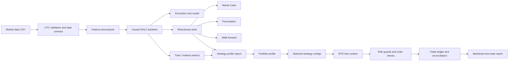

# Personal Trading Portfolio Snapshot

This repository is a curated snapshot of self-built trading research and
execution infrastructure. It is meant to show engineering process: data
contracts, causal backtesting, robustness testing, reporting, brokerless runtime
tests and fail-closed MT5 execution architecture.

## Fast Review

If you have 5 minutes:

1. Open [EVIDENCE_PACKAGE_OVERVIEW.pdf](EVIDENCE_PACKAGE_OVERVIEW.pdf).
2. Skim the sample reports:
   - [strategy profile](source_snapshots/trading_research/sample_reports/strategy_profile/ContinuationBreakout_XAUUSD/summary.md)
   - [portfolio profile](source_snapshots/trading_research/sample_reports/portfolio_profile/ThreeStrategy_Portfolio_Profile/summary.md)
   - [live trade report](source_snapshots/live_trading/sample_reports/live_trade_report_sample.md)

If you have 20 minutes:

1. Read [trading_research README](source_snapshots/trading_research/README.md).
2. Read [live_trading README](source_snapshots/live_trading/README.md).
3. Inspect the key implementation files listed below.

## Pipeline

## Key Files

Research:

- [engine/backtester.py](source_snapshots/trading_research/engine/backtester.py)
- [engine/execution_cost_model.py](source_snapshots/trading_research/engine/execution_cost_model.py)
- [data/data_manager.py](source_snapshots/trading_research/data/data_manager.py)
- [strategy_profile/reporting.py](source_snapshots/trading_research/strategy_profile/reporting.py)
- [portfolio_profile/analyzer.py](source_snapshots/trading_research/portfolio_profile/analyzer.py)

Live runtime:

- [hub_runtime.py](source_snapshots/live_trading/hub_runtime.py)
- [run_hub.py](source_snapshots/live_trading/run_hub.py)
- [shared/registry.py](source_snapshots/live_trading/shared/registry.py)
- [core/order_intent_store.py](source_snapshots/live_trading/core/order_intent_store.py)
- [analytics/trade_report.py](source_snapshots/live_trading/analytics/trade_report.py)
- [risk/position_sizer.py](source_snapshots/live_trading/risk/position_sizer.py)

## Validation

- `source_snapshots/trading_research`: `88 passed`; `compileall` passed.
- `source_snapshots/live_trading`: `264 passed, 2 subtests passed`;
  `compileall` passed.

## Excluded

- real credentials, `.env`, keys, certificates and local terminal paths;
- runtime SQLite state, local health files and broker exports;
- raw/normalized market-data dumps;
- private workflow notes and generated caches.
